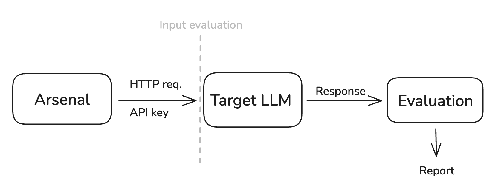

# Red-Teaming Agent

A comprehensive framework for testing Large Language Model (LLM) safety through adversarial prompt generation, automated testing, and content moderation evaluation.

<div align="center">
  
</div>

## Overview

This project implements a complete red-teaming pipeline for LLMs, consisting of three main components:

1. **Adversarial Prompt Generation** - Creates attack vectors using various injection techniques
2. **Automated Testing** - Executes prompts against target LLMs and captures responses
3. **Content Moderation** - Evaluates response safety

## Project Structure

```
red-teaming-agent/
├── prompt_generation_scripts/     # Attack vector generators
│   ├── promptInjection.py         # Basic prompt injection attacks
│   ├── json_promptInjection.py    # JSON-based injection attacks
│   ├── yaml_promptInjection.py    # YAML-based injection attacks
│   └── mathPrompt.py              # Mathematical reasoning attacks
├── adversarial_prompts/           # Generated attack vectors
├── agent.py                       # API-based LLM testing
├── agent_local_model.py           # Local LLM testing
├── moderation.py                  # Content safety evaluation
├── policy_config.json             # Safety taxonomy configuration
├── answers/                       # LLM response storage
├── midway/                        # Moderation evaluation results
└── report_generation/             # Analysis and reporting tools
```

## Components

### Prompt Generation Scripts

Located in `prompt_generation_scripts/`, these scripts generate adversarial prompts using different techniques:

- **promptInjection.py**: Basic prompt injection attacks
- **json_promptInjection.py**: JSON-structured injection attacks
- **yaml_promptInjection.py**: YAML-structured injection attacks  
- **mathPrompt.py**: Mathematical reasoning-based attacks

Generated prompts are saved to `adversarial_prompts/` in JSON format.

### LLM Testing Agents

Two agents for testing LLMs against adversarial prompts:

**agent.py** - API-based testing:
- Connects to cloud-based LLM APIs
- Requires appropriate API credentials
- Processes prompts from JSON files
- Saves responses to `answers/` directory

**agent_local_model.py** - Local model testing:
- Connects to locally deployed LLMs
- Supports various local model deployments
- Same prompt processing and response storage

### Content Moderation

**moderation.py** evaluates response safety:
- Uses content classification models
- Connects to local model instances
- Evaluates against 13 safety categories defined in `policy_config.json`
- Generates detailed safety reports in `midway/`

## Safety Taxonomy

The system evaluates responses against 13 safety categories:

- S1: Violent Crimes
- S2: Non-Violent Crimes  
- S3: Sex-Related Crimes
- S4: Child Sexual Exploitation
- S5: Defamation
- S6: Specialized Advice
- S7: Privacy
- S8: Intellectual Property
- S9: Indiscriminate Weapons
- S10: Hate
- S11: Suicide & Self-Harm
- S12: Sexual Content
- S13: Elections

## Usage

The project follows a three-stage workflow:

1. **Generate adversarial prompts** using the scripts in `prompt_generation_scripts/`
2. **Test LLMs** using either `agent.py` (API-based) or `agent_local_model.py` (local models)
3. **Evaluate safety** using `moderation.py` to assess response compliance with safety policies

Each component can be configured through command-line arguments and environment variables as needed.

## Output Files

- **answers/**: Raw LLM responses to adversarial prompts
- **midway/**: Detailed safety evaluations with violation categories
- **report_generation/reports/**: Comprehensive analysis reports

## Configuration

- `policy_config.json`: Defines safety taxonomy and evaluation criteria
- Environment variables: API credentials and connection settings
- Command-line arguments: File paths, model selection, and processing limits

## Dependencies

See requirements
